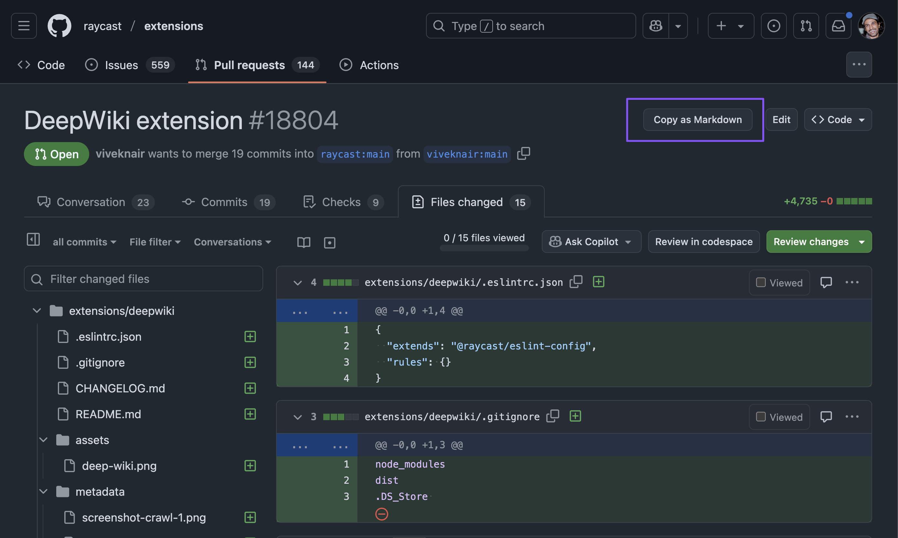
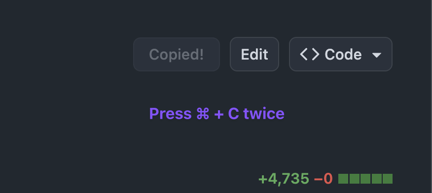

### Diff Copier

This Chrome extension adds a "Copy as Markdown" button to GitHub Pull Request pages. Clicking this button, or pressing `Cmd+C` twice quickly (when no text is selected), fetches the diff content of the PR and copies it to the user's clipboard in Markdown format.

> **Warning:** This extension fetches the PR content by accessing the `.diff` URL provided by GitHub. Frequent use, especially on large repositories or across many PRs in a short period, may lead to hitting GitHub's rate limits, resulting in temporary errors (like HTTP 429).

_Button state after successful copy:_

## Features

- Adds a "Copy as Markdown" button to the header actions on GitHub PR pages (`https://github.com/*/*/pull/*`).
- Allows copying the PR diff using a keyboard shortcut: `Cmd+C` + `Cmd+C` (or `Ctrl+C` + `Ctrl+C` on Windows/Linux).
- Fetches the `.diff` version of the PR.
- Copies the content to the clipboard.
- Handles GitHub's dynamic page navigation.

## Installation for Development

To install this extension locally for development or testing:

1.  **Clone or Download:** Get the code from this repository onto your local machine.
2.  **Open Chrome Extensions:** Open Google Chrome, type `chrome://extensions/` into the address bar, and press Enter.
3.  **Enable Developer Mode:** Ensure the "Developer mode" toggle switch (usually in the top-right corner) is enabled.
4.  **Load Unpacked:**
    - Click the "Load unpacked" button (usually in the top-left corner).
    - In the file dialog that appears, navigate to the directory where you cloned/downloaded this repository.
    - Select the `extension` folder (the one containing `manifest.json`).
    - Click "Select" or "Open".
5.  **Verify:** The "GitHub PR Diff Markdown Copier" extension should now appear in your list of extensions and be enabled. You can visit any GitHub Pull Request page to see the "Copy as Markdown" button.

## Usage

- **Button:** Navigate to a GitHub PR page. Click the "Copy as Markdown" button in the header actions area.
- **Keyboard Shortcut:** On a GitHub PR page, ensure no text is selected, then quickly press `Cmd+C` twice (or `Ctrl+C` twice).

The button text will change to "Copying..." and then "Copied!" upon success. Paste the content into any text editor that supports Markdown.
